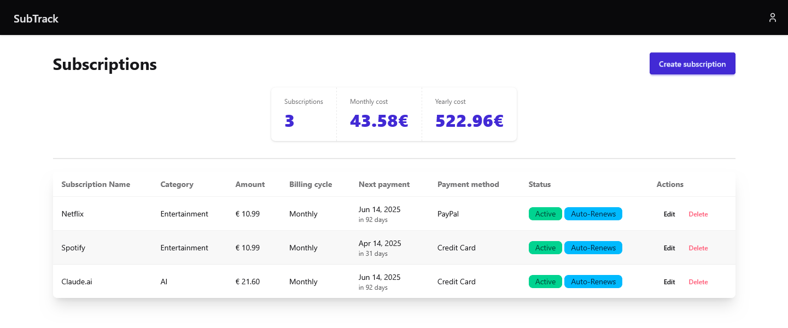

# SubTrack

SubTrack is a personal subscription tracker designed to help you manage and monitor your recurring expenses, such as Netflix, Spotify, and other services.

This project serves as a learning experience for Symfony and Tailwind CSS while building a practical and useful application.

# Screenshots

